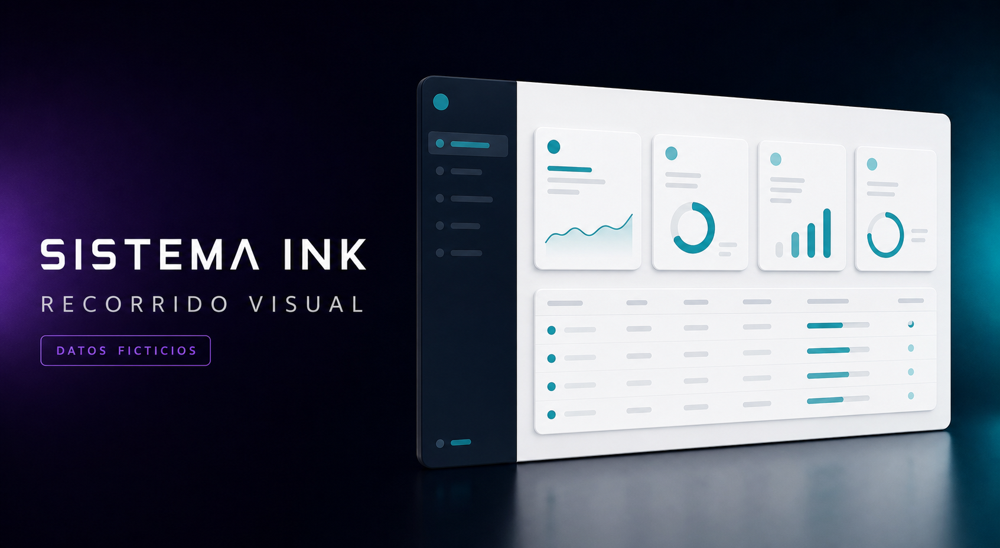

# Sistema Ink — Showcase visual



Recorrido público y deliberadamente limitado de **Sistema Ink**, una aplicación de gestión para talleres de personalización y producción ligera.

Este repositorio muestra una recreación visual independiente con datos sintéticos. **No contiene el código del producto comercial**, sus reglas de negocio, API, contratos, base de datos, autenticación, instaladores ni documentación técnica interna.

## Qué incluye

- Los 15 módulos visibles del menú actual: Panel principal, Métricas, Ventas, Caja,
  Producción, Clientes, Cotizaciones, Control de entregas, Artículos del
  cliente, Calidad, Finanzas, Compras, Inventario, Catálogo y Administración.
- Pantallas ficticias diferenciadas para las siete opciones de Administración
  y las cinco opciones de Catálogo, incluidas Métricas de ventas y Proveedores.
- Una vista de Compras con indicadores de recepción, listado y detalle visual.
- Configuración diferenciada para documentos Carta/A4 y bauchers térmicos de
  58 u 80 mm, con prueba y vista previa únicamente ilustrativas.
- Seis vistas complementarias para conocer el acceso, la selección del servidor,
  el PIN, la impresión por estación, el baucher térmico y el estado sin conexión.
- Una síntesis comercial del flujo integrado, la impresión, el control de
  accesos y la continuidad operativa.
- Una guía contextual integrada en la ventana de la demostración. Se adapta al
  módulo activo y señala el menú, las subopciones, el área de trabajo y el
  estado del entorno sin bloquear la navegación.
- Datos, estados, importes, usuarios, equipos y referencias exclusivamente
  sintéticos.

La navegación entre módulos, subpantallas y pasos de la guía funciona únicamente
en memoria. La guía se abre desde el botón **Guía** de la barra superior y
permanece dentro de la interfaz. Las vistas complementarias avanzan cada ocho
segundos y pueden pausarse; también se detienen al enfocarlas, al colocar el
puntero encima, al salir de la ventana visible o cuando el sistema solicita
movimiento reducido. Los botones operativos están deshabilitados y recargar la
página restaura la vista inicial.

## Límites deliberados

- Sin conexión a servicios del producto comercial.
- Sin base de datos, cuentas, autenticación, telemetría o almacenamiento del navegador.
- Sin acciones de guardar, cobrar, exportar, restaurar o administrar.
- Sin datos tomados de personas, empresas, pedidos o instalaciones reales.
- Sin código XAML, .NET, SQL, contratos, endpoints o binarios del producto.

Los identificadores usan el prefijo `DEMO-`, los correos de muestra usan el dominio reservado `.example` y la interfaz identifica permanentemente el entorno como ficticio.

## Ejecución local

Requiere Node.js 22.13 o posterior y pnpm 11.

```bash
pnpm install --frozen-lockfile
pnpm dev
```

Para verificar la compilación y las barreras de publicación:

```bash
pnpm check:public
pnpm test
```

## Controles de publicación

`check:public` revisa el conjunto de archivos que Git podría publicar y falla si encuentra extensiones del producto, artefactos de base de datos, respaldos, binarios, rutas internas, llamadas de red, persistencia del navegador o dependencias operativas prohibidas.

La revisión automatizada complementa, pero no sustituye, la revisión humana antes de cada publicación.

## Portafolio

El caso de estudio forma parte del [portafolio de Eliezer Ponce](https://eliezer47.github.io/portfolio/#/project). El showcase se mantiene como repositorio separado para no mezclar su historial con el producto comercial.

## Propiedad intelectual

Este repositorio es visible públicamente para fines de presentación, pero no es software de código abierto. Consulta [COPYRIGHT.md](COPYRIGHT.md).

Contacto comercial: [eliezerponcexd@gmail.com](mailto:eliezerponcexd@gmail.com)
