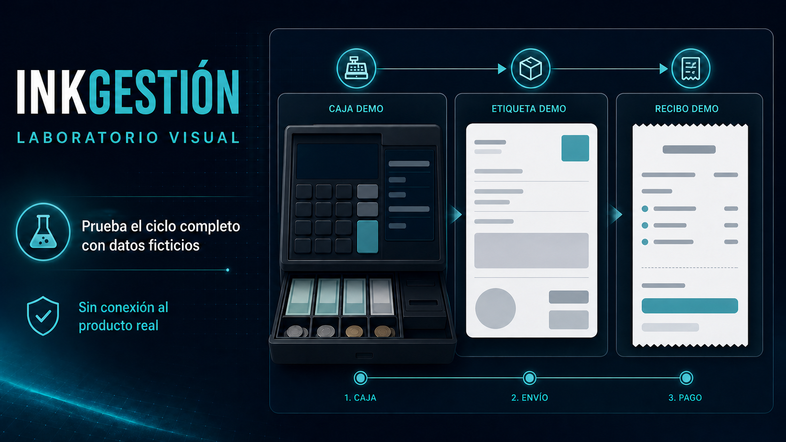

# InkGestión — Showcase y laboratorio visual



Recorrido público y laboratorio funcional deliberadamente limitado de **InkGestión**, una solución de gestión creada para Ink Multiservicios.

Este repositorio muestra una recreación visual independiente con datos sintéticos. **No contiene el código del producto comercial**, sus reglas de negocio, API, contratos, base de datos, autenticación, instaladores ni documentación técnica interna.

## Qué incluye

- Los 15 módulos visibles del menú actual: Panel principal, Métricas, Ventas, Caja,
  Producción, Clientes, Cotizaciones, Control de entregas, Artículos del
  cliente, Calidad, Finanzas, Compras, Inventario, Catálogo y Administración.
- Un **Modo LAB** reiniciable que simula un ciclo completo: aprobación de
  cotización, creación del pedido, anticipo, producción, control de calidad,
  preparación del despacho, entrega, cobro final y revisión del comprobante.
- Impacto visual coordinado en Caja, Inventario y Finanzas a medida que avanza
  el pedido ficticio, con una bitácora determinista del escenario.
- Un anticipo ficticio compuesto por efectivo y saldo a favor, más un cobro
  final por transferencia LAB, sin movimientos bancarios ni contables reales.
- Pantallas ficticias diferenciadas para las diez opciones actuales de
  Administración y las cinco opciones de Catálogo, incluidas Cajas físicas,
  Auditoría, Puesta en marcha, Métricas de ventas y Proveedores.
- Una vista de Compras con indicadores de recepción, listado y detalle visual.
- Configuración diferenciada para documentos Carta/A4, etiquetas de despacho y
  bauchers térmicos de 58 u 80 mm, con editor simple, prueba y vista previa
  únicamente ilustrativas.
- Contexto comercial del cliente, acciones visibles para cambiar fecha, agregar
  o cancelar conceptos, historial y conciliación de Caja y fuentes financieras
  claramente separadas.
- Seis vistas complementarias para conocer el acceso, la selección del servidor,
  el PIN, la impresión por estación, el baucher térmico y el estado sin conexión.
- Una síntesis comercial del flujo integrado, la impresión, el control de
  accesos y la continuidad operativa.
- Una guía contextual integrada en la ventana de la demostración. Se adapta al
  módulo activo y señala el menú, las subopciones, el área de trabajo y el
  estado del entorno sin bloquear la navegación.
- Datos, estados, importes, usuarios, equipos y referencias exclusivamente
  sintéticos.

La navegación entre módulos, subpantallas y pasos de la guía funciona únicamente
en memoria. La guía se abre desde el botón **Guía** de la barra superior y
permanece dentro de la interfaz. Las vistas complementarias avanzan cada ocho
segundos y pueden pausarse; también se detienen al enfocarlas, al colocar el
puntero encima, al salir de la ventana visible o cuando el sistema solicita
movimiento reducido. En **Recorrido** los controles operativos permanecen
deshabilitados. En **Modo LAB** solo se habilita la siguiente acción válida del
escenario y recargar la página restaura el estado inicial.

## Uso del Modo LAB

El laboratorio inicia con `COT-DEMO-0201`, una cotización sintética para
`Café Nube Demo`. La franja superior indica el paso actual y conduce al módulo
correspondiente. Cada acción actualiza únicamente el estado temporal de la
página; las operaciones fuera de orden se rechazan.

El escenario aplica C$ 3,000 de efectivo ficticio y C$ 1,000 de saldo a favor
en el anticipo. Después de calidad prepara una etiqueta DEMO de 40 × 30 mm,
registra la entrega, aplica el saldo restante y presenta `REC-DEMO-0201` en una
vista previa integrada. Ninguno de estos pasos imprime, guarda archivos ni
conecta cuentas reales.

El botón **Reiniciar LAB** restaura la cotización, la bitácora, los saldos y las
existencias ficticias. El selector **Recorrido** conserva la presentación visual
anterior para explorar los demás módulos sin ejecutar el escenario.

## Límites deliberados

- Sin conexión a servicios del producto comercial.
- Sin base de datos, cuentas, autenticación, telemetría o almacenamiento del navegador.
- Sin acciones reales de guardar, cobrar, exportar, restaurar o administrar;
  las acciones del LAB son transiciones visuales en memoria.
- Sin datos tomados de personas, empresas, pedidos o instalaciones reales.
- Sin código XAML, .NET, SQL, contratos, endpoints o binarios del producto.

Los identificadores usan el prefijo `DEMO-`, los correos de muestra usan el dominio reservado `.example` y la interfaz identifica permanentemente el entorno como ficticio.

## Ejecución local

Requiere Node.js 22.13 o posterior y pnpm 11.

```bash
pnpm install --frozen-lockfile
pnpm dev
```

Para verificar la compilación y las barreras de publicación:

```bash
pnpm check:public
pnpm test
```

## Controles de publicación

`check:public` revisa el conjunto de archivos que Git podría publicar y falla si encuentra extensiones del producto, artefactos de base de datos, respaldos, binarios, rutas internas, llamadas de red, persistencia del navegador o dependencias operativas prohibidas.

La revisión automatizada complementa, pero no sustituye, la revisión humana antes de cada publicación.

## Portafolio

El caso de estudio forma parte del [portafolio de Eliezer Ponce](https://eliezer47.github.io/portfolio/#/project). El showcase se mantiene como repositorio separado para no mezclar su historial con el producto comercial.

## Propiedad intelectual

Este repositorio es visible públicamente para fines de presentación, pero no es software de código abierto. Consulta [COPYRIGHT.md](COPYRIGHT.md).

Contacto comercial: [eliezerponcexd@gmail.com](mailto:eliezerponcexd@gmail.com)
